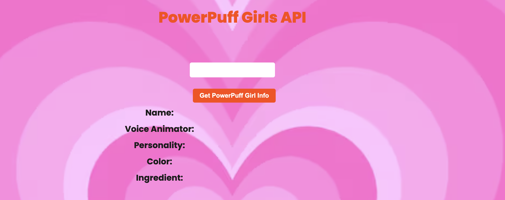

# 💖 Powerpuff Girls API

A playful server-side web app that fetches and displays data about your favorite Powerpuff Girls — **Blossom, Bubbles, and Buttercup!**  
Type a character’s name into the input box and instantly see their image, color, personality, voice actor, and more pop onto the screen.

---
[Link to project](https://powerpuff-girls-server-api-production.up.railway.app/)
## 🖼️ Screenshot

---

## 🧱 Tech Stack
**Node.js + Express.js** **HTML**  **CSS** **JavaScript**  

---

## 🖼️ Screenshot

---

## ⚙️ How It Works
Users enter the name of a Powerpuff Girl into the input field and click the button to fetch data.  
The app retrieves the corresponding character’s image, color, personality, and other details, then displays them dynamically in a clear two-column layout — labels on the left, values on the right.  
Each image appears above the data, creating a simple, fun, and interactive experience that feels true to the Powerpuff Girls’ playful energy.

---

## 🛠️ How It’s Made
This project was built using a lightweight **Express.js** server to deliver both static files and a custom API response.  
The frontend uses **JavaScript** to fetch and render data dynamically, while **CSS** handles all visuals and animations.  
The layout is organized with responsive grids, ensuring that the app looks balanced on both desktop and mobile.  
Every element was designed with clarity and contrast in mind, emphasizing a clean separation between structure, style, and behavior.

---

## ⚡ Optimizations
- Lightweight API design for fast response times.  
- Consistent image sizing to maintain visual balance.  
- Responsive grid system for seamless mobile viewing.  
- Smooth CSS animations for character images.  
- Code organized with clear separation of concerns.  

---

## 🧠 Lessons Learned
- Strengthened understanding of full-stack development with Express.  
- Reinforced the importance of designing for accessibility and contrast.  
- Learned how to structure a small server project for scalability and clarity.  
- Improved handling of asynchronous operations with `fetch()` and clean JSON responses.  
- Gained experience balancing fun, thematic design with clean functionality.
